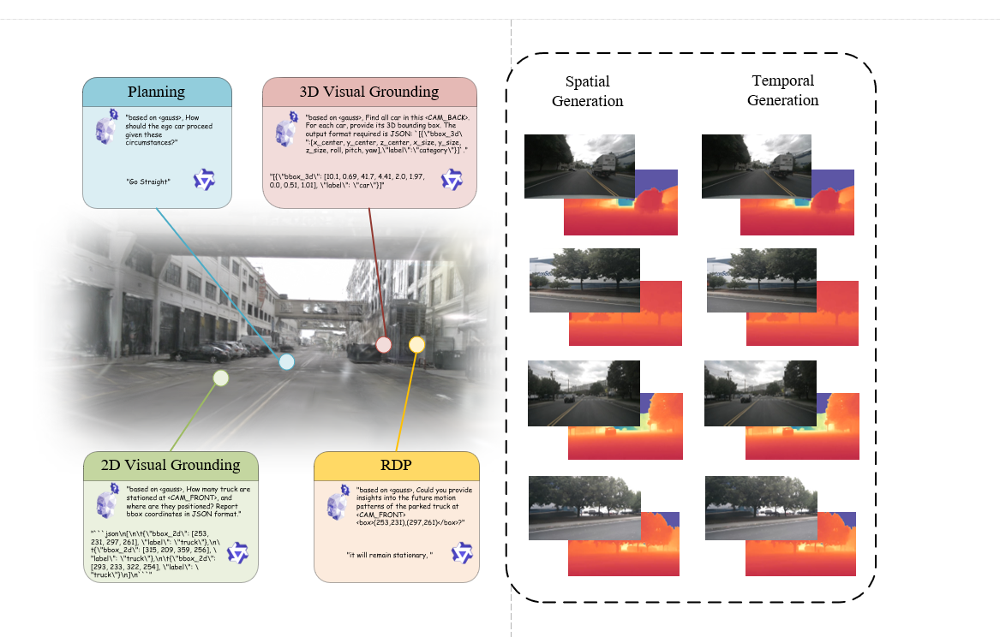
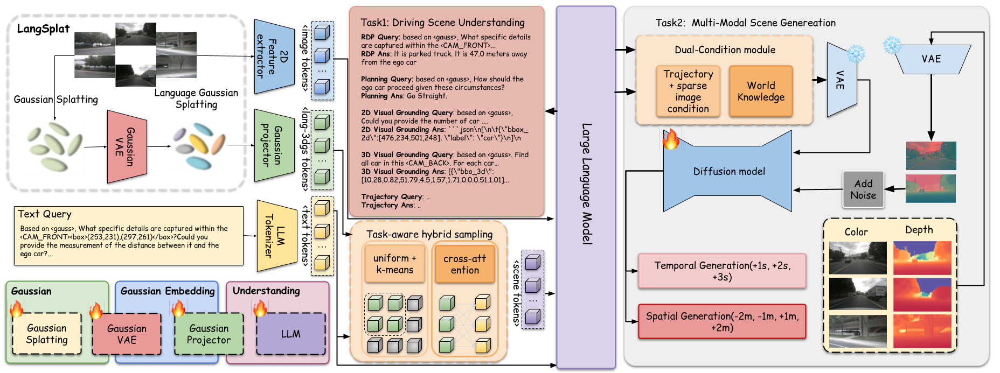

# GaussianDWM: 3D Gaussian Driving World Model for Unified Scene Understanding and Multi-Modal Generation

[](http://arxiv.org/abs/2512.23180)
[]()
<!-- [](LICENSE) -->


> **GaussianDWM** is the first unified 3D Gaussian-based world model framework that achieves comprehensive scene understanding and scene generation for driving scenarios. It efficiently encodes complex scenes, samples task-relevant information, and handles diverse question-answering tasks. Moreover, by leveraging the extracted world knowledge, our framework guides the generative model to perform accurate spatial and temporal scene generation.

---

## 🎯 Overview

GaussianDWM addresses three core challenges in autonomous driving world models:

- **🔧 Token Extraction & Projection**: Novel module for 3D Gaussian scene representations with task-aware language-guided sampling that overcomes gaussian alignment and token length limitations while preserving essential spatial information
- **🎨 Dual-condition Generation**: Multi-modal scene generation framework combining high-level features from world knowledge with low-level features from images
- **🔗 Unified Understanding & Generation**: Bridges the gap between scene comprehension and generation, enabling accurate understanding and coherent future scene prediction

  

---

## ✨ Key Features

| Feature | Description |
|-----------|-------------|
| **Unified Framework** | First 3D Gaussian-based world model supporting both scene understanding and generation |
| **Semantic Space Alignment** | Aligns 3D Gaussian features to the semantic space of LLM for accurate cross-modal understanding |
| **Task-aware Sampling** | Language-guided sampling strategy selects relevant Gaussians from dense representations |
| **Dual-condition Generation** | High-level language features and low-level image features jointly guide multi-modal synthesis |
| **Spatial & Temporal** | Supports novel view synthesis (1m/2m shifts) and future prediction (1s/2s ahead) |
| **Large-scale 3DGS-QA Dataset** | First large-scale dataset pairing 3D Gaussian features with diverse driving QA tasks (~2M samples) |

---

## 🏗️ Architecture

  

---

## 💥 News

- [2025/12]: Paper and code coming soon!


---

## 📦 Dataset

**We introduce the first large-scale dataset that pairs 3D Gaussian Splatting features with diverse language-based driving tasks**, encompassing ~1.9M training samples and ~358K test samples across scene understanding, trajectory prediction, and multi-modal reasoning.

The dataset is built upon [nuScenes](https://www.nuscenes.org/) and processed with [LangSplat](https://github.com/minghanqin/LangSplat) to extract language-aligned 3D Gaussian features for each scene frame. Each sample contains multi-view images, corresponding 3D Gaussian features (`.pth` files), and structured QA annotations covering diverse driving scenarios.

### Dataset Overview

Our dataset is organized as follows:

```
./data
├── dataset-NuIntereact
│   ├── README.md
│   ├── test.json
│   └── train.json
├── dataset-OmniDrive
│   ├── README.md
│   ├── test.json
│   └── train.json
├── dataset-Traject
│   ├── README.md
│   ├── test.json
│   └── train.json
├── gauss
│   ├── cache
│   └── output-full-6v
├── nuscenes
│   ├── can_bus
│   ├── maps
│   ├── samples
│   ├── sweeps
│   ├── v1.0-trainval
│   └── ...
├── utility.json
└── utility.py
```

### NuInteract-based QA Data

We adopt all caption and multi-task QA data from [NuInteract Dataset](https://github.com/zc-zhao/DriveMonkey), with most data used in its original format. For 2D visual grounding (2DVG) tasks, we unify the detection output into structured JSON format to better support autoregressive generation by language models, avoiding mixed natural language and bounding box representations.

**Task categories include:**
- **2DVG**: 2D visual grounding with JSON-formatted bbox outputs
- **3DVG**: 3D visual grounding in camera coordinates
- **RD&P**: Region description and prediction tasks
- **Caption**: Dense scene captioning
- **Planning**: Multi-view planning reasoning

**Statistics by category (train/test):**

| Category | Train | Test |
|----------|------:|-----:|
| RD&P | 810,302 | 167,596 |
| 3DVG | 208,616 | 44,860 |
| 2DVG | 189,450 | 40,373 |
| Caption | 181,286 | - |
| Planning | 25,952 | 1,058 |
| **Total** | **1,415,606** | **253,887** |

For detailed information, please refer to [src/data/README_nu.md](src/data/README_nu.md).

### Trajectory Prediction Data

Trajectory prediction data is extracted from nuScenes dataset and its corresponding CAN bus data. To balance data volume and task diversity, we design prediction horizons at **0.5s, 1s, 2s, 3s, 5s, and 10s**. The input consists of 4 historical frames with vehicle pose and dynamics. We use structured JSON format for outputs, where each trajectory point is represented by 5 values: `[x, y, z, sin(yaw), cos(yaw)]`.

**Statistics by prediction horizon (train/test):**

| Horizon | Train | Test |
|---------|------:|-----:|
| 0.5s | 24,630 | 5,269 |
| 1s | 23,930 | 5,119 |
| 2s | 22,530 | 4,819 |
| 3s | 21,130 | 4,519 |
| 5s | 18,330 | 3,919 |
| 10s | 11,330 | 2,419 |
| **Total** | **121,880** | **26,064** |

For detailed information, please refer to [src/data/README_traj.md](src/data/README_traj.md).

### OmniDrive-based Data

We adopt data from [OmniDrive](https://github.com/NVlabs/OmniDrive), following the setup in [HERMES](https://github.com/LMD0311/HERMES). We use only the **Desc** (scene description), **VQA** (visual question answering), and **Conv** (multi-turn conversation) subsets. Considering that questions in multi-turn conversations are largely independent, we split the VQA and Conv data into individual QA pairs.

**Statistics by category (train/test):**

| Category | Train | Test |
|----------|------:|-----:|
| Omni_Conv | 260,612 | 48,108 |
| Omni_VQA | 111,884 | 24,081 |
| Omni_Desc | 27,968 | 6,019 |
| **Total** | **400,464** | **78,208** |

For detailed information, please refer to [src/data/README_omni.md](src/data/README_omni.md).

### Download

> **Note**: Instructions for downloading the complete dataset will be provided upon paper acceptance.

---

## 📚 Citation

If you find our work useful in your research, please consider citing:

```bibtex
@article{deng2025gaussiandwm,
  title={GaussianDWM: 3D Gaussian Driving World Model for Unified Scene Understanding and Multi-Modal Generation},
  author={Deng, Tianchen and Chen, Xuefeng and Chen, Yi and Chen, Qu and Xu, Yuyao and Yang, Lijin and Xu, Le and Zhang, Yu and Zhang, Bo and Huang, Wuxiong and Wang, Hesheng},
  journal={arXiv preprint arXiv:2512.23180},
  year={2025}
}
```

---

## 📄 License

This project is licensed under the Apache License 2.0 - see the [LICENSE](LICENSE) file for details.

---

## ❤️ Acknowledgments

We would like to thank the following open-source projects:

- [Qwen3-VL](https://github.com/QwenLM/Qwen3-VL) - Vision-language model foundation
- [Dist4D](https://github.com/royalmelon0505/dist4d) - Multi-modal scene representation

---

<div align="center">

**🌟 Star us on GitHub if you find this project helpful! 🌟**

</div>

 
