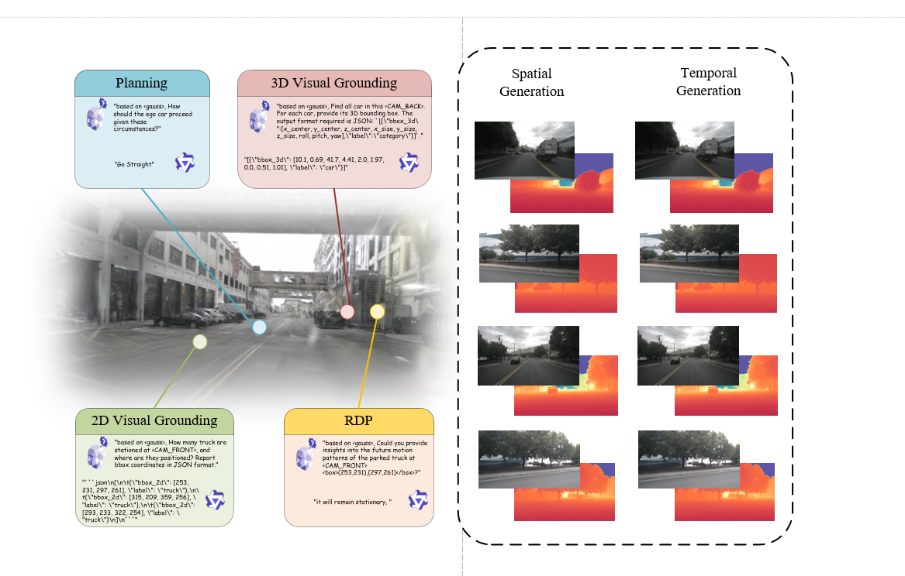
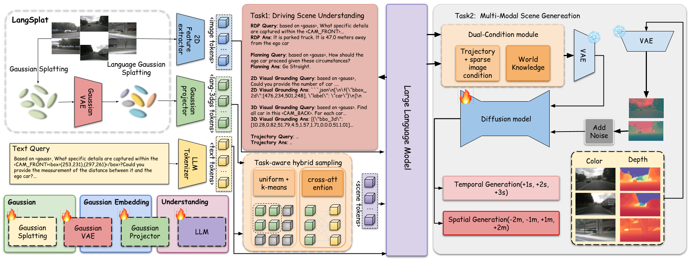

# GaussianDWM: 3D Gaussian Driving World Model for Unified Scene Understanding and Multi-Modal Generation

[]()
[]()
<!-- [](LICENSE) -->


> **GaussianDWM** is the first unified 3D Gaussian-based world model framework that achieves comprehensive scene understanding and scene generation for driving scenarios. It efficiently encodes complex scenes, samples task-relevant information, and handles diverse question-answering tasks. Moreover, by leveraging the extracted world knowledge, our framework guides the generative model to perform accurate spatial and temporal scene generation.

---

## 🎯 Overview

GaussianDWM addresses three core challenges in autonomous driving world models:

- **🔧 3D Gaussian Token Extraction & Projection**: We propose a novel 3D scene representation that aligns language features with geometric information through 3D Gaussian representation. This enables explicit correspondence and alignment between language and scene geometry.
- **🔧 Task-aware Sampling**:  task-aware language-guided sampling for 3D Gaussian ellipsoids that overcomes Gaussian alignment and token length limitations while preserving essential spatial information
- **🎨 Dual-condition Generation**: Multi-modal scene generation framework combining high-level features from world knowledge with low-level features from images
- **🔗 Unified Understanding & Generation**: Bridges the gap between scene comprehension and generation, enabling accurate understanding and coherent future scene prediction

  

---

## ✨ Key Features

| Feature | Description |
|-----------|-------------|
| **Unified Framework** | First 3D Gaussian-based world model supporting both scene understanding and generation |
| **Lauguage Space Alignment** | Aligns 3D Gaussian features to the semantic space of LLM for accurate cross-modal understanding |
| **Task-aware Sampling** | Language-guided sampling strategy selects relevant Gaussians from dense representations |
| **Dual-condition** | High-level language features and low-level image features jointly guide multi-modal synthesis |
| **Spatial & Temporal Generation** | Supports novel view synthesis (1m/2m shifts) and future prediction (1s/2s ahead) |

---

## 🏗️ Architecture

  

---

## 💥 News

- [2025/12]: Paper and code coming soon!


---

## 📚 Citation

If you find our work useful in your research, please consider citing:

```bibtex
@article{deng2025gaussiandwm,
  title={GaussianDWM: 3D Gaussian Driving World Model for Unified Scene Understanding and Multi-Modal Generation},
  author={Deng, Tianchen and Chen, Xuefeng and Chen, Yi and Chen, Qu and Xu, Yuyao and Yang, Lijin and Xu, Le and Zhang, Yu and Zhang, Bo and Huang, Wuxiong and Wang, Hesheng},
  journal={arXiv preprint},
  year={2025}
}
```

---

## 📄 License

This project is licensed under the Apache License 2.0 - see the [LICENSE](LICENSE) file for details.

---

## ❤️ Acknowledgments

We would like to thank the following open-source projects:

- [Qwen3-VL](https://github.com/QwenLM/Qwen3-VL) - Vision-language model foundation
- [Dist4D](https://github.com/royalmelon0505/dist4d) - Multi-modal scene representation

---

<div align="center">

**🌟 Star us on GitHub if you find this project helpful! 🌟**

</div>

 

